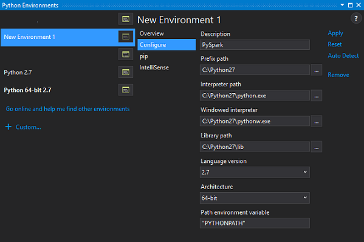
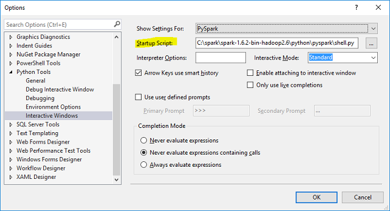

Title: Developing PySpark Applications on Windows using Visual Studio
Date: 2016-07-06
Modified: 2016-07-16
Category: Big Data
Tags: pyspark, spark, ptvs, visual studio, python
Slug: pyspark-visual-studio
Disqus_identifier: pyspark-visual-studio-427b127c17a74df98e0c8ba42eea4a8c
Summary: Use Visual Studio 2015 as your IDE for developing Apache Spark applications in Python on Windows.
Status: draft

Here I describe the workflow to get started with developing [Apache Spark](http://spark.apache.org/) applications in Python on Windows using Visual Studio 2015 as your Integrated Development Environment (IDE). We will install Spark, configure the installation and setup a Python environment specific to Spark in Visual Studio that will allow us to launch an interactive window with Spark support as well as allow us to run and debug spark scripts in Visual Studio. 

[TOC]

## Installing Apache Spark

From the Spark [download page](http://spark.apache.org/downloads.html), choose the latest Spark release. For the package type, select a version that is pre-built for the latest version of Hadoop such as *Pre-built for Hadoop 2.6*. For choose a download type, select *Direct Download*. Click the download link in item 4 to download a zipped tarball file ending in .tgz extension.

In order to install Apache Spark, there is no need to run any installer. You can extract the files in any folder of your choice but make sure that your folder path or the folder name does not include any spaces. In my case, I created a folder called `spark` in my C drive and unzipped the contents in a folder called `spark-1.6.2-bin-hadoop2.6` using the [7Zip]((http://www.7-zip.org/) tool. So all files related to Spark are in a folder called `C:\spark\spark-1.6.2-bin-hadoop2.6`. I will refer to this folder as `SPARK_HOME` from now on.

To test if your installation was successful, try running the `bin\pyspark` script in the SPARK_HOME directory from a Windows Command Prompt. This script starts the PySpark shell which can be used to interactively work with Spark.

## Configuring the Spark Installation

By default, the Spark installation on Windows does not include the `winutils.exe` utility that is used by Spark. If you do not tell your Spark installation where to look for `winutils.exe`, you will see error messages when running the PySpark shell (which does not affect running the PySpark shell) and will not be able to run any standalone Python scripts using the `bin\spark-submit` script.

Let's download the winutils.exe and configure our Spark installation to find the winutils.exe.

1. Create a `hadoop\bin` folder inside the SPARK_HOME folder.

2. Download the [winutils.exe](https://github.com/steveloughran/winutils) for the version of hadoop against which your Spark installation was built for. In my case the hadoop version was 2.6.0 and so I [downloaded] (https://github.com/steveloughran/winutils/raw/master/hadoop-2.6.0/bin/winutils.exe) the winutils.exe for hadoop 2.6.0 and copied it to the `hadoop\bin` folder in the SPARK_HOME folder.

3. Create a system environment variable in Windows called `SPARK_HOME` that points to the SPARK_HOME folder path.

4. Create a system environment variable in Windows called `HADOOP_HOME` that points to the hadoop folder inside the SPARK_HOME folder. 
> Since the `hadoop` folder is inside the SPARK_HOME folder, it is better to create `HADOOP_HOME` environment variable using a value of `%SPARK_HOME%\hadoop`

If you now run the `bin\pyspark` script from a Windows Command Prompt, the error messages related to winutils.exe should be gone.

One more change to your Spark installation can be made to lower the verbosity of the messages written to the console. In order to do this

1. Copy the `log4j.properties.template` file in the `SPARK_HOME\conf` folder as `log4j.properties` file.
2. Set the `log4j.rootCategory` property value to `WARN, console`
3. Save the `log4j.properties` file.

Now only warning and error messages will be logged to the console and informative messages will not be logged.     

## Setting up the PySpark Python Environment within Visual Studio

Visual Studio 2015 includes Python language support. If you did not install this feature when installing Visual Studio, you need to [download](https://github.com/Microsoft/PTVS/releases/latest) and [install](https://github.com/Microsoft/PTVS/wiki/PTVS-Installation) the Python Tools for Visual Studio (PTVS) extension. 

We will create a PySpark environment in Visual Studio that we can use with any of our Python projects and  will also add the ability to launch an [interactive window](https://github.com/Microsoft/PTVS/wiki/Interactive-REPL) in Visual Studio that has the PySpark Shell. 

1. Create a system environment variable in Windows called `PYTHONPATH` with a value `%SPARK_HOME%\bin;%SPARK_HOME%\python;%SPARK_HOME%\python\lib\py4j-0.9-src.zip`.
  > The version of `py4j` package might be different depending on your version of Spark. Use the proper version.
2. Open Visual Studio and go to `Tools > Python Tools > Python Environments`

3. In the *Python Environments* dialog, click the *Custom...* link button and specify the following settings for the new environment.

    

4. Click the *Apply* button to create the new `PySpark` Python environment.

5. From the *Overview* group of the `PySpark` environment, click the *Configure interactive window* button.

6. In the *Options* dialog, specify the `python\pyspark\shell.py` script from the SPARK_HOME folder as the *Startup Script* for the interactive window.

    

7. Click *OK* to close the *Options* dialog.

You can now launch a new PySpark interactive window from `Tools > Python Tools > PySpark Interactive`.

In order to create a standalone PySpark application, you can create a new Visual Studio project of type *Python Application* and set its environment to `PySpark`. This will make sure that all PySpark dependencies are available to the project and will allow you to run your PySpark scripts with or without debugging from within Visual Studio.

## References

I used the following references to gather information about this post.

- [Setting up winutils.exe](https://blogs.msdn.microsoft.com/arsen/2016/02/09/resolving-spark-1-6-0-java-lang-nullpointerexception-not-found-value-sqlcontext-error-when-running-spark-shell-on-windows-10-64-bit/)

- [Using Visual Studio with Apache Spark](http://mund-consulting.com/Blog/using-ipython-and-visual-studio-with-apache-spark/)

- Downloading Spark and Getting Started (chapter 2) from O'Reilly's [Learning Spark](https://www.amazon.com/dp/1449358624) book.