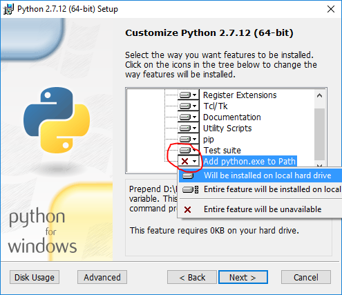

Title: Getting Started with PySpark on Windows
Date: 2016-07-09
Modified: 2016-07-09 22:45
Category: Big Data
Tags: pyspark, spark, python
Slug: pyspark-windows
Disqus_identifier: pyspark-windows-9abce9a1333940f2883a41bd0f121ca4
Summary: Use Apache Spark with Python on Windows.
Status: published

I decided to teach myself how to work with big data and came across [Apache Spark](http://spark.apache.org). While I had heard of [Apache Hadoop](http://hadoop.apache.org), to use Hadoop for working with big data, I had to write code in Java which I was not really looking forward to as I love to write code in Python. Spark supports a Python programming API called [PySpark](http://spark.apache.org/docs/latest/api/python/pyspark.html) that is actively maintained and was enough to convince me to start learning PySpark for working with big data.

In this post, I describe how I got started with PySpark on Windows. My laptop is running Windows 10. So the screenshots are specific to Windows 10. I am also assuming that you are comfortable working with the Command Prompt on Windows. You do not have to be an expert, but you need to know how to start a Command Prompt and run commands such as those that help you move around your computer's file system. In case you need a refresher, a quick [introduction](http://www.cs.princeton.edu/courses/archive/spr05/cos126/cmd-prompt.html) might be handy.

> Often times, many open source projects do not have good Windows support. So I had to first figure out if Spark and PySpark would work well on Windows. The official Spark [documentation](http://spark.apache.org/docs/latest/#downloading) does mention about supporting Windows.   

[TOC]

## Installing Prerequisites

PySpark requires Java version 7 or later and Python version 2.6 or later. Let's first check if they are already installed or install them and make sure that PySpark can work with these two components.

### Java
Java is used by many other software. So it is quite possible that a required version (in our case version 7 or later) is already available on your computer. To check if Java is available and find it's version, open a Command Prompt and type the following command.

```dos
    java -version
```

If Java is installed and configured to work from a Command Prompt, running the above command should print the information about the Java version to the console. For example, I got the following output on my laptop.

```
   java version "1.8.0_92"
   Java(TM) SE Runtime Environment (build 1.8.0_92-b14)
   Java HotSpot(TM) 64-Bit Server VM (build 25.92-b14, mixed mode)
```

Instead if you get a message like

```
    'java' is not recognized as an internal or external command, operable program or batch file.
```

It means you need to install Java. To do so, 

1. Go to the Java [download](http://www.oracle.com/technetwork/java/javase/downloads/) page. In case the download link has changed, search for `Java SE Runtime Environment` on the internet and you should be able to find the download page.

2. Click the *Download* button beneath *JRE* 

3. Accept the license agreement and download the latest version of `Java SE Runtime Environment` installer. I suggest getting the exe for Windows x64 (such as `jre-8u92-windows-x64.exe`) unless you are using a 32 bit version of Windows in which case you need to get the *Windows x86 Offline* version.

4. Run the installer. 

After the installation is complete, close the Command Prompt if it was already open, open it and check if you can successfully run `java -version` command.

### Python

Python is used by many other software. So it is quite possible that a required version (in our case version 2.6 or later) is already available on your computer. To check if Python is available and find it's version, open a Command Prompt and type the following command.


```dos
    python --version
```

If Python is installed and configured to work from a Command Prompt, running the above command should print the information about the Python version to the console. For example, I got the following output on my laptop.

```
   Python 2.7.10
```

Instead if you get a message like

```
    'python' is not recognized as an internal or external command, operable program or batch file.
```

It means you need to install Python. To do so,

1. Go to the Python [download](https://www.python.org/downloads/windows/) page.

2. Click the *Latest Python 2 Release* link.

3. Download the `Windows x86-64 MSI installer` file. If you are using a 32 bit version of Windows download the `Windows x86 MSI installer` file.

4. When you run the installer, on the **Customize Python** section, make sure that the option *Add python.exe to Path* is selected. If this option is not selected, some of the PySpark utilities such as `pyspark` and `spark-submit` might not work.

    

After the installation is complete, close the Command Prompt if it was already open, open it and check if you can successfully run `python --version` command.

## Installing Apache Spark

1. Go to the Spark [download](http://spark.apache.org/downloads.html) page.

2. For *Choose a Spark release*, select the latest stable release of Spark.

3. For *Choose a package type*, select a version that is pre-built for the latest version of Hadoop such as *Pre-built for Hadoop 2.6*.

4. For *Choose a download type*, select *Direct Download*.

5. Click the link next to *Download Spark* to download a zipped tarball file ending in .tgz extension such as `spark-1.6.2-bin-hadoop2.6.tgz`.

6. In order to install Apache Spark, there is no need to run any installer. You can extract the files from the downloaded tarball in any folder of your choice using the [7Zip](http://www.7-zip.org/) tool. 

    > Make sure that the folder path and the folder name containing Spark files do not contain any spaces.

In my case, I created a folder called `spark` on my C drive and extracted the zipped tarball in a folder called `spark-1.6.2-bin-hadoop2.6`. So all Spark files are in a folder called `C:\spark\spark-1.6.2-bin-hadoop2.6`. From now on, I will refer to this folder as `SPARK_HOME` in this post.

To test if your installation was successful, open a Command Prompt, change to SPARK_HOME directory and type `bin\pyspark`. This should start the PySpark shell which can be used to interactively work with Spark. I got the following messages in the console after running `bin\pyspark` command.

```
Python 2.7.10 (default, May 23 2015, 09:44:00) [MSC v.1500 64 bit (AMD64)] on win32
Type "help", "copyright", "credits" or "license" for more information.
Using Spark's default log4j profile: org/apache/spark/log4j-defaults.properties
16/07/09 15:44:10 INFO SparkContext: Running Spark version 1.6.2
16/07/09 15:44:10 WARN NativeCodeLoader: Unable to load native-hadoop library for your platform... using builtin-java classes where applicable
16/07/09 15:44:10 ERROR Shell: Failed to locate the winutils binary in the hadoop binary path
java.io.IOException: Could not locate executable null\bin\winutils.exe in the Hadoop binaries.
        at org.apache.hadoop.util.Shell.getQualifiedBinPath(Shell.java:355)
        at org.apache.hadoop.util.Shell.getWinUtilsPath(Shell.java:370)
        at org.apache.hadoop.util.Shell.<clinit>(Shell.java:363)
        at org.apache.hadoop.util.StringUtils.<clinit>(StringUtils.java:79)
        at org.apache.hadoop.security.Groups.parseStaticMapping(Groups.java:104)
        at org.apache.hadoop.security.Groups.<init>(Groups.java:86)
        at org.apache.hadoop.security.Groups.<init>(Groups.java:66)
        at org.apache.hadoop.security.Groups.getUserToGroupsMappingService(Groups.java:280)
        at org.apache.hadoop.security.UserGroupInformation.initialize(UserGroupInformation.java:271)
        at org.apache.hadoop.security.UserGroupInformation.ensureInitialized(UserGroupInformation.java:248)
        at org.apache.hadoop.security.UserGroupInformation.loginUserFromSubject(UserGroupInformation.java:763)
        at org.apache.hadoop.security.UserGroupInformation.getLoginUser(UserGroupInformation.java:748)
        at org.apache.hadoop.security.UserGroupInformation.getCurrentUser(UserGroupInformation.java:621)
        at org.apache.spark.util.Utils$$anonfun$getCurrentUserName$1.apply(Utils.scala:2198)
        at org.apache.spark.util.Utils$$anonfun$getCurrentUserName$1.apply(Utils.scala:2198)
        at scala.Option.getOrElse(Option.scala:120)
        at org.apache.spark.util.Utils$.getCurrentUserName(Utils.scala:2198)
        at org.apache.spark.SparkContext.<init>(SparkContext.scala:322)
        at org.apache.spark.api.java.JavaSparkContext.<init>(JavaSparkContext.scala:59)
        at sun.reflect.NativeConstructorAccessorImpl.newInstance0(Native Method)
        at sun.reflect.NativeConstructorAccessorImpl.newInstance(Unknown Source)
        at sun.reflect.DelegatingConstructorAccessorImpl.newInstance(Unknown Source)
        at java.lang.reflect.Constructor.newInstance(Unknown Source)
        at py4j.reflection.MethodInvoker.invoke(MethodInvoker.java:234)
        at py4j.reflection.ReflectionEngine.invoke(ReflectionEngine.java:381)
        at py4j.Gateway.invoke(Gateway.java:214)
        at py4j.commands.ConstructorCommand.invokeConstructor(ConstructorCommand.java:79)
        at py4j.commands.ConstructorCommand.execute(ConstructorCommand.java:68)
        at py4j.GatewayConnection.run(GatewayConnection.java:209)
        at java.lang.Thread.run(Unknown Source)
16/07/09 15:44:10 INFO SecurityManager: Changing view acls to: deel4986
16/07/09 15:44:10 INFO SecurityManager: Changing modify acls to: deel4986
16/07/09 15:44:10 INFO SecurityManager: SecurityManager: authentication disabled; ui acls disabled; users with view permissions: Set(deel4986); users with modify permissions: Set(deel4986)
16/07/09 15:44:11 INFO Utils: Successfully started service 'sparkDriver' on port 53607.
16/07/09 15:44:11 INFO Slf4jLogger: Slf4jLogger started
16/07/09 15:44:11 INFO Remoting: Starting remoting
16/07/09 15:44:11 INFO Remoting: Remoting started; listening on addresses :[akka.tcp://sparkDriverActorSystem@localhost:53620]
16/07/09 15:44:11 INFO Utils: Successfully started service 'sparkDriverActorSystem' on port 53620.
16/07/09 15:44:11 INFO SparkEnv: Registering MapOutputTracker
16/07/09 15:44:11 INFO SparkEnv: Registering BlockManagerMaster
16/07/09 15:44:11 INFO DiskBlockManager: Created local directory at C:\Users\deel4986\AppData\Local\Temp\blockmgr-8c931369-8987-4e52-9562-f3e561aad111
16/07/09 15:44:11 INFO MemoryStore: MemoryStore started with capacity 511.1 MB
16/07/09 15:44:11 INFO SparkEnv: Registering OutputCommitCoordinator
16/07/09 15:44:11 INFO Utils: Successfully started service 'SparkUI' on port 4040.
16/07/09 15:44:11 INFO SparkUI: Started SparkUI at http://localhost:4040
16/07/09 15:44:11 INFO Executor: Starting executor ID driver on host localhost
16/07/09 15:44:11 INFO Utils: Successfully started service 'org.apache.spark.network.netty.NettyBlockTransferService' on port 53657.
16/07/09 15:44:11 INFO NettyBlockTransferService: Server created on 53657
16/07/09 15:44:11 INFO BlockManagerMaster: Trying to register BlockManager
16/07/09 15:44:11 INFO BlockManagerMasterEndpoint: Registering block manager localhost:53657 with 511.1 MB RAM, BlockManagerId(driver, localhost, 53657)
16/07/09 15:44:12 INFO BlockManagerMaster: Registered BlockManager
Welcome to
      ____              __
     / __/__  ___ _____/ /__
    _\ \/ _ \/ _ `/ __/  '_/
   /__ / .__/\_,_/_/ /_/\_\   version 1.6.2
      /_/

Using Python version 2.7.10 (default, May 23 2015 09:44:00)
SparkContext available as sc, HiveContext available as sqlContext.
>>>
```
The last message provides a hint on how to work with Spark in the PySpark shell using the `sc` or `sqlContext` names. For example, typing `sc.version` in the shell should print the version of Spark. You can exit from the PySpark shell in the same way you exit from any Python shell by typing `exit()`. 

> The PySpark shell outputs a few messages on exit. So you need to hit enter to get back to the Command Prompt.


## Configuring the Spark Installation

Starting the PySpark shell produces a lot of messages of type INFO, ERROR and WARN. In this section we will see how to remove these messages. 

By default, the Spark installation on Windows does not include the `winutils.exe` utility that is used by Spark. If you do not tell your Spark installation where to look for `winutils.exe`, you will see error messages when running the PySpark shell such as

```
ERROR Shell: Failed to locate the winutils binary in the hadoop binary path
java.io.IOException: Could not locate executable null\bin\winutils.exe in the Hadoop binaries.
```

This error message does not prevent the PySpark shell from starting. However if you try to run a standalone Python script using the `bin\spark-submit` utility, you will get an error. For example, try running the `wordcount.py` script from the `examples` folder in the Command Prompt when you are in the SPARK_HOME directory.

```
    bin\spark-submit examples\src\main\python\wordcount.py README.md
```  

which produces the following error that also points to missing `winutils.exe`

```
Using Spark's default log4j profile: org/apache/spark/log4j-defaults.properties
16/07/09 16:23:27 INFO SparkContext: Running Spark version 1.6.2
16/07/09 16:23:27 WARN NativeCodeLoader: Unable to load native-hadoop library for your platform... using builtin-java classes where applicable
16/07/09 16:23:27 ERROR Shell: Failed to locate the winutils binary in the hadoop binary path
java.io.IOException: Could not locate executable null\bin\winutils.exe in the Hadoop binaries.
        at org.apache.hadoop.util.Shell.getQualifiedBinPath(Shell.java:355)
        at org.apache.hadoop.util.Shell.getWinUtilsPath(Shell.java:370)
        at org.apache.hadoop.util.Shell.<clinit>(Shell.java:363)
        at org.apache.hadoop.util.StringUtils.<clinit>(StringUtils.java:79)
        at org.apache.hadoop.security.Groups.parseStaticMapping(Groups.java:104)
        at org.apache.hadoop.security.Groups.<init>(Groups.java:86)
        at org.apache.hadoop.security.Groups.<init>(Groups.java:66)
        at org.apache.hadoop.security.Groups.getUserToGroupsMappingService(Groups.java:280)
        at org.apache.hadoop.security.UserGroupInformation.initialize(UserGroupInformation.java:271)
        at org.apache.hadoop.security.UserGroupInformation.ensureInitialized(UserGroupInformation.java:248)
        at org.apache.hadoop.security.UserGroupInformation.loginUserFromSubject(UserGroupInformation.java:763)
        at org.apache.hadoop.security.UserGroupInformation.getLoginUser(UserGroupInformation.java:748)
        at org.apache.hadoop.security.UserGroupInformation.getCurrentUser(UserGroupInformation.java:621)
        at org.apache.spark.util.Utils$$anonfun$getCurrentUserName$1.apply(Utils.scala:2198)
        at org.apache.spark.util.Utils$$anonfun$getCurrentUserName$1.apply(Utils.scala:2198)
        at scala.Option.getOrElse(Option.scala:120)
        at org.apache.spark.util.Utils$.getCurrentUserName(Utils.scala:2198)
        at org.apache.spark.SparkContext.<init>(SparkContext.scala:322)
        at org.apache.spark.api.java.JavaSparkContext.<init>(JavaSparkContext.scala:59)
        at sun.reflect.NativeConstructorAccessorImpl.newInstance0(Native Method)
        at sun.reflect.NativeConstructorAccessorImpl.newInstance(Unknown Source)
        at sun.reflect.DelegatingConstructorAccessorImpl.newInstance(Unknown Source)
        at java.lang.reflect.Constructor.newInstance(Unknown Source)
        at py4j.reflection.MethodInvoker.invoke(MethodInvoker.java:234)
        at py4j.reflection.ReflectionEngine.invoke(ReflectionEngine.java:381)
        at py4j.Gateway.invoke(Gateway.java:214)
        at py4j.commands.ConstructorCommand.invokeConstructor(ConstructorCommand.java:79)
        at py4j.commands.ConstructorCommand.execute(ConstructorCommand.java:68)
        at py4j.GatewayConnection.run(GatewayConnection.java:209)
        at java.lang.Thread.run(Unknown Source)
16/07/09 16:23:27 INFO SecurityManager: Changing view acls to: deel4986
16/07/09 16:23:27 INFO SecurityManager: Changing modify acls to: deel4986
16/07/09 16:23:27 INFO SecurityManager: SecurityManager: authentication disabled; ui acls disabled; users with view permissions: Set(deel4986); users with modify permissions: Set(deel4986)
16/07/09 16:23:28 INFO Utils: Successfully started service 'sparkDriver' on port 59506.
16/07/09 16:23:28 INFO Slf4jLogger: Slf4jLogger started
16/07/09 16:23:28 INFO Remoting: Starting remoting
16/07/09 16:23:28 INFO Remoting: Remoting started; listening on addresses :[akka.tcp://sparkDriverActorSystem@localhost:59519]
16/07/09 16:23:28 INFO Utils: Successfully started service 'sparkDriverActorSystem' on port 59519.
16/07/09 16:23:28 INFO SparkEnv: Registering MapOutputTracker
16/07/09 16:23:28 INFO SparkEnv: Registering BlockManagerMaster
16/07/09 16:23:28 INFO MemoryStore: MemoryStore started with capacity 511.1 MB
16/07/09 16:23:28 INFO SparkEnv: Registering OutputCommitCoordinator
16/07/09 16:23:28 INFO Utils: Successfully started service 'SparkUI' on port 4040.
16/07/09 16:23:28 INFO SparkUI: Started SparkUI at http://localhost:4040
16/07/09 16:23:28 ERROR SparkContext: Error initializing SparkContext.
java.lang.NullPointerException
        at java.lang.ProcessBuilder.start(Unknown Source)
        at org.apache.hadoop.util.Shell.runCommand(Shell.java:482)
        at org.apache.hadoop.util.Shell.run(Shell.java:455)
        at org.apache.hadoop.util.Shell$ShellCommandExecutor.execute(Shell.java:715)
        at org.apache.hadoop.fs.FileUtil.chmod(FileUtil.java:873)
        at org.apache.hadoop.fs.FileUtil.chmod(FileUtil.java:853)
        at org.apache.spark.util.Utils$.fetchFile(Utils.scala:407)
        at org.apache.spark.SparkContext.addFile(SparkContext.scala:1386)
        at org.apache.spark.SparkContext.addFile(SparkContext.scala:1340)
        at org.apache.spark.SparkContext$$anonfun$15.apply(SparkContext.scala:491)
        at org.apache.spark.SparkContext$$anonfun$15.apply(SparkContext.scala:491)
        at scala.collection.immutable.List.foreach(List.scala:318)
        at org.apache.spark.SparkContext.<init>(SparkContext.scala:491)
        at org.apache.spark.api.java.JavaSparkContext.<init>(JavaSparkContext.scala:59)
        at sun.reflect.NativeConstructorAccessorImpl.newInstance0(Native Method)
        at sun.reflect.NativeConstructorAccessorImpl.newInstance(Unknown Source)
        at sun.reflect.DelegatingConstructorAccessorImpl.newInstance(Unknown Source)
        at java.lang.reflect.Constructor.newInstance(Unknown Source)
        at py4j.reflection.MethodInvoker.invoke(MethodInvoker.java:234)
        at py4j.reflection.ReflectionEngine.invoke(ReflectionEngine.java:381)
        at py4j.Gateway.invoke(Gateway.java:214)
        at py4j.commands.ConstructorCommand.invokeConstructor(ConstructorCommand.java:79)
        at py4j.commands.ConstructorCommand.execute(ConstructorCommand.java:68)
        at py4j.GatewayConnection.run(GatewayConnection.java:209)
        at java.lang.Thread.run(Unknown Source)
16/07/09 16:23:29 INFO SparkUI: Stopped Spark web UI at http://localhost:4040
16/07/09 16:23:29 INFO MapOutputTrackerMasterEndpoint: MapOutputTrackerMasterEndpoint stopped!
16/07/09 16:23:29 INFO MemoryStore: MemoryStore cleared
16/07/09 16:23:29 INFO BlockManager: BlockManager stopped
16/07/09 16:23:29 INFO BlockManagerMaster: BlockManagerMaster stopped
16/07/09 16:23:29 WARN MetricsSystem: Stopping a MetricsSystem that is not running
16/07/09 16:23:29 INFO OutputCommitCoordinator$OutputCommitCoordinatorEndpoint: OutputCommitCoordinator stopped!
16/07/09 16:23:29 INFO SparkContext: Successfully stopped SparkContext
16/07/09 16:23:29 INFO RemoteActorRefProvider$RemotingTerminator: Shutting down remote daemon.
Traceback (most recent call last):
  File "c:/spark/spark-1.6.2-bin-hadoop2.6/examples/src/main/python/wordcount.py", line 30, in <module>
16/07/09 16:23:29 INFO RemoteActorRefProvider$RemotingTerminator: Remote daemon shut down; proceeding with flushing remote transports.
    sc = SparkContext(appName="PythonWordCount")
  File "c:\spark\spark-1.6.2-bin-hadoop2.6\python\lib\pyspark.zip\pyspark\context.py", line 115, in __init__
  File "c:\spark\spark-1.6.2-bin-hadoop2.6\python\lib\pyspark.zip\pyspark\context.py", line 172, in _do_init
  File "c:\spark\spark-1.6.2-bin-hadoop2.6\python\lib\pyspark.zip\pyspark\context.py", line 235, in _initialize_context
  File "c:\spark\spark-1.6.2-bin-hadoop2.6\python\lib\py4j-0.9-src.zip\py4j\java_gateway.py", line 1064, in __call__
  File "c:\spark\spark-1.6.2-bin-hadoop2.6\python\lib\py4j-0.9-src.zip\py4j\protocol.py", line 308, in get_return_value
py4j.protocol.Py4JJavaError: An error occurred while calling None.org.apache.spark.api.java.JavaSparkContext.
: java.lang.NullPointerException
        at java.lang.ProcessBuilder.start(Unknown Source)
        at org.apache.hadoop.util.Shell.runCommand(Shell.java:482)
        at org.apache.hadoop.util.Shell.run(Shell.java:455)
        at org.apache.hadoop.util.Shell$ShellCommandExecutor.execute(Shell.java:715)
        at org.apache.hadoop.fs.FileUtil.chmod(FileUtil.java:873)
        at org.apache.hadoop.fs.FileUtil.chmod(FileUtil.java:853)
        at org.apache.spark.util.Utils$.fetchFile(Utils.scala:407)
        at org.apache.spark.SparkContext.addFile(SparkContext.scala:1386)
        at org.apache.spark.SparkContext.addFile(SparkContext.scala:1340)
        at org.apache.spark.SparkContext$$anonfun$15.apply(SparkContext.scala:491)
        at org.apache.spark.SparkContext$$anonfun$15.apply(SparkContext.scala:491)
        at scala.collection.immutable.List.foreach(List.scala:318)
        at org.apache.spark.SparkContext.<init>(SparkContext.scala:491)
        at org.apache.spark.api.java.JavaSparkContext.<init>(JavaSparkContext.scala:59)
        at sun.reflect.NativeConstructorAccessorImpl.newInstance0(Native Method)
        at sun.reflect.NativeConstructorAccessorImpl.newInstance(Unknown Source)
        at sun.reflect.DelegatingConstructorAccessorImpl.newInstance(Unknown Source)
        at java.lang.reflect.Constructor.newInstance(Unknown Source)
        at py4j.reflection.MethodInvoker.invoke(MethodInvoker.java:234)
        at py4j.reflection.ReflectionEngine.invoke(ReflectionEngine.java:381)
        at py4j.Gateway.invoke(Gateway.java:214)
        at py4j.commands.ConstructorCommand.invokeConstructor(ConstructorCommand.java:79)
        at py4j.commands.ConstructorCommand.execute(ConstructorCommand.java:68)
        at py4j.GatewayConnection.run(GatewayConnection.java:209)
        at java.lang.Thread.run(Unknown Source)

16/07/09 16:23:29 INFO ShutdownHookManager: Shutdown hook called
16/07/09 16:23:29 INFO RemoteActorRefProvider$RemotingTerminator: Remoting shut down.
```

### Installing winutils

Let's download the `winutils.exe` and configure our Spark installation to find `winutils.exe`.

1. Create a `hadoop\bin` folder inside the SPARK_HOME folder.

2. Download the [winutils.exe](http://github.com/steveloughran/winutils) for the version of hadoop against which your Spark installation was built for. In my case the hadoop version was 2.6.0. So I [downloaded](http://github.com/steveloughran/winutils/raw/master/hadoop-2.6.0/bin/winutils.exe) the winutils.exe for hadoop 2.6.0 and copied it to the `hadoop\bin` folder in the SPARK_HOME folder.

3. Create a system environment variable in Windows called `SPARK_HOME` that points to the SPARK_HOME folder path. Search the internet in case you need a refresher on how to create environment variables in your version of Windows such as articles like [these](http://www.computerhope.com/issues/ch000549.htm).

4. Create another system environment variable in Windows called `HADOOP_HOME` that points to the hadoop folder inside the SPARK_HOME folder. 

> Since the `hadoop` folder is inside the SPARK_HOME folder, it is better to create `HADOOP_HOME` environment variable using a value of `%SPARK_HOME%\hadoop`. That way you don't have to change `HADOOP_HOME` if `SPARK_HOME` is updated.

If you now run the `bin\pyspark` script from a Windows Command Prompt, the error messages related to `winutils.exe` should be gone. For example, I got the following messages after running the `bin\pyspark` utility after configuring `winutils`

```
Python 2.7.10 (default, May 23 2015, 09:44:00) [MSC v.1500 64 bit (AMD64)] on win32
Type "help", "copyright", "credits" or "license" for more information.
Using Spark's default log4j profile: org/apache/spark/log4j-defaults.properties
16/07/09 16:37:51 INFO SparkContext: Running Spark version 1.6.2
16/07/09 16:37:52 WARN NativeCodeLoader: Unable to load native-hadoop library for your platform... using builtin-java classes where applicable
16/07/09 16:37:52 INFO SecurityManager: Changing view acls to: deel4986
16/07/09 16:37:52 INFO SecurityManager: Changing modify acls to: deel4986
16/07/09 16:37:52 INFO SecurityManager: SecurityManager: authentication disabled; ui acls disabled; users with view permissions: Set(deel4986); users with modify permissions: Set(deel4986)
16/07/09 16:37:52 INFO Utils: Successfully started service 'sparkDriver' on port 62029.
16/07/09 16:37:52 INFO Slf4jLogger: Slf4jLogger started
16/07/09 16:37:52 INFO Remoting: Starting remoting
16/07/09 16:37:52 INFO Remoting: Remoting started; listening on addresses :[akka.tcp://sparkDriverActorSystem@localhost:62042]
16/07/09 16:37:52 INFO Utils: Successfully started service 'sparkDriverActorSystem' on port 62042.
16/07/09 16:37:52 INFO SparkEnv: Registering MapOutputTracker
16/07/09 16:37:52 INFO SparkEnv: Registering BlockManagerMaster
16/07/09 16:37:52 INFO MemoryStore: MemoryStore started with capacity 511.1 MB
16/07/09 16:37:53 INFO SparkEnv: Registering OutputCommitCoordinator
16/07/09 16:37:53 INFO Utils: Successfully started service 'SparkUI' on port 4040.
16/07/09 16:37:53 INFO SparkUI: Started SparkUI at http://localhost:4040
16/07/09 16:37:53 INFO Executor: Starting executor ID driver on host localhost
16/07/09 16:37:53 INFO Utils: Successfully started service 'org.apache.spark.network.netty.NettyBlockTransferService' on port 62079.
16/07/09 16:37:53 INFO NettyBlockTransferService: Server created on 62079
16/07/09 16:37:53 INFO BlockManagerMaster: Trying to register BlockManager
16/07/09 16:37:53 INFO BlockManagerMasterEndpoint: Registering block manager localhost:62079 with 511.1 MB RAM, BlockManagerId(driver, localhost, 62079)
16/07/09 16:37:53 INFO BlockManagerMaster: Registered BlockManager
Welcome to
      ____              __
     / __/__  ___ _____/ /__
    _\ \/ _ \/ _ `/ __/  '_/
   /__ / .__/\_,_/_/ /_/\_\   version 1.6.2
      /_/

Using Python version 2.7.10 (default, May 23 2015 09:44:00)
SparkContext available as sc, HiveContext available as sqlContext.
>>>
```
The `bin\spark-submit` utility can also be successfully used to run `wordcount.py` script.

### Configuring the log level for Spark

There are still a lot of extra INFO messages in the console everytime you start or exit from a PySpark shell or run the `spark-submit` utility. So let's make one more change to our Spark installation so that only warning and error messages are written to the console. In order to do this

1. Copy the `log4j.properties.template` file in the `SPARK_HOME\conf` folder as `log4j.properties` file in the `SPARK_HOME\conf` folder.

2. Set the `log4j.rootCategory` property value to `WARN, console`

3. Save the `log4j.properties` file.

Now any informative messages will not be logged to the console. For example, I got the following messages after running the `bin\pyspark` utility once I configured the log level to WARN.

```
Python 2.7.10 (default, May 23 2015, 09:44:00) [MSC v.1500 64 bit (AMD64)] on win32
Type "help", "copyright", "credits" or "license" for more information.
16/07/09 16:45:47 WARN NativeCodeLoader: Unable to load native-hadoop library for your platform... using builtin-java classes where applicable
Welcome to
      ____              __
     / __/__  ___ _____/ /__
    _\ \/ _ \/ _ `/ __/  '_/
   /__ / .__/\_,_/_/ /_/\_\   version 1.6.2
      /_/

Using Python version 2.7.10 (default, May 23 2015 09:44:00)
SparkContext available as sc, HiveContext available as sqlContext.
>>>
```

## Summary

In order to work with PySpark, start a Windows Command Prompt and change into your SPARK_HOME directory.

- To start a PySpark shell, run the `bin\pyspark` utility. Once your are in the PySpark shell use the `sc` and `sqlContext` names and type `exit()` to return back to the Command Prompt.

- To run a standalone Python script, run the `bin\spark-submit` utility and specify the path of your Python script as well as any arguments your Python script needs in the Command Prompt. For example, to run the `wordcount.py` script from `examples` directory in your SPARK_HOME folder, you can run the following command

    ```
       bin\spark-submit examples\src\main\python\wordcount.py README.md  
    ```  

## References

I used the following references to gather information about this post.

- [Setting up winutils.exe](https://blogs.msdn.microsoft.com/arsen/2016/02/09/resolving-spark-1-6-0-java-lang-nullpointerexception-not-found-value-sqlcontext-error-when-running-spark-shell-on-windows-10-64-bit/)

- Downloading Spark and Getting Started (chapter 2) from O'Reilly's [Learning Spark](https://www.amazon.com/dp/1449358624) book.

